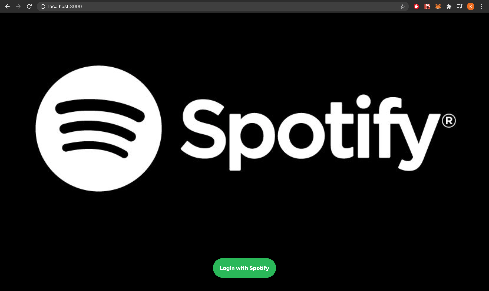

<!-- PROJECT LOGO -->
<br />
<p align="center">
  <a href="">
    
  </a>

  <h3 align="center">Spotify Clone Using ReactJS</h3>

  <p align="center">
    Spotify Clone using React JS, Context API, Spotify Web API
    <br />
<!--     <a href="https://clone-6afbf.web.app/"><strong>View Live Website »</strong></a> -->
    <br />
    <br />
   
  </p>
</p>

<!-- ABOUT THE PROJECT -->
## Final Project Screenshots

### Login Page
<a href="">
    
  </a>
  <br />

<a href="">
    
  </a>
  
### Home Page
<a href="">
    
  </a>
  <br />

## Built With

* [React JS](https://reactjs.org/)
* [React Hooks](https://reactjs.org/docs/hooks-intro.html)
* [React Context API](https://reactjs.org/docs/context.html)
* [HTML5](https://developer.mozilla.org/en-US/docs/Web/Guide/HTML/HTML5)
* [CSS3](https://developer.mozilla.org/en-US/docs/Archive/CSS3)
* [Spotify Web API](https://developer.spotify.com/)
* [Node js](https://nodejs.org/en/docs/)

<!-- GETTING STARTED -->
## Getting Started

To get a local copy up and running follow these simple steps.

### Installation

1. Clone the repo
```sh
git clone https://github.com/shahriya1995/spotify-clone.git
```
2. Install NPM packages of front-end
```sh
cd spotify-clone
npm install
```
3. Install NPM packages of back-end
```sh
npm install
```

## Contact

Riya Shah-  
[LinkedIn](https://www.linkedin.com/in/riyarahulshah/)     
[Portfolio](riya.netlify.app)     
Email - riyashah0595@gmail.com  
           

